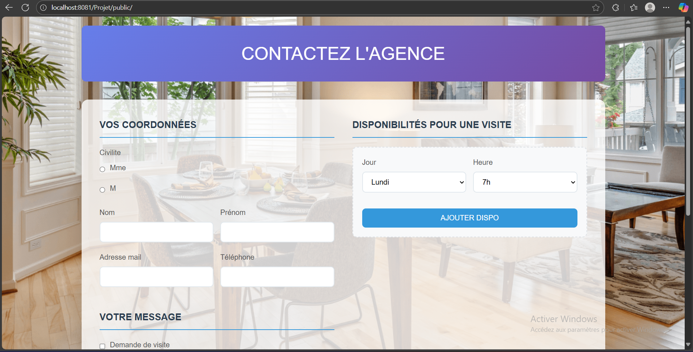

# Test Tremplin - Agence Immobilière

## 📋 À propos
**Nom**: Selmi  
**Prénom**: Ahmed  
**Niveau d'étude**: 3eme Informatique de gestion  
**Durée du stage**: 3-4 mois  
**Email**: ahmedsalmi928@gmail.com

## 🖼️ Screenshot


## 🚀 Installation et démarrage

### Prérequis
- Docker
- Docker Compose

### Installation
```bash
# Cloner le dépôt
git clone https://github.com/AhmedSelmi04/test-tremplin.git
cd test-tremplin

# Démarrer les services
docker compose up -d

# Accéder à l'application
# http://localhost:8081/Projet/public
```
❓ Réponses aux questions

### Avez-vous trouvé l'exercice facile ou difficile ?
J'ai trouvé cet exercice d'un niveau moyen. Il présentait un bon équilibre entre des concepts que je maîtrisais et des défis techniques qui m'ont permis d'apprendre.

### Quelles difficultés avez-vous rencontrées ?
Configuration Docker 
Gestion des permissions Apache

### Avez-vous appris de nouveaux outils ?
Docker Compose pour la containerisation
Laravel avec l'architecture MVC

### Pourquoi avoir choisi ces outils ?
J'ai choisi Laravel pour son écosystème complet et Docker pour garantir un environnement de développement reproductible.

### Avez-vous utilisé la stack proposée ?
Oui, j'ai utilisé la stack LAMP (Linux, Apache, MySQL, PHP) avec Laravel et Docker comme proposé.

### Utilisez-vous régulièrement Docker ?
oui
